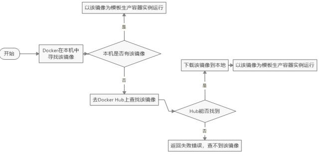

# Docker

[Docker官网](http://www.docker.com)，[DockerHub](https://hub.docker.com/)

## 1、基础篇

### 1、简介

Docker是基于Go语言实现的云开源项目。Docker的主要目标是“Build，Ship and Run Any App,Anywhere”，也就是通过对应用组件的封装、分发、部署、运行等生命周期的管理，使用户的APP（可以是一个WEB应用或数据库应用等等）及其运行环境能够做到“一次镜像，处处运行”。

Docker 就是在Linux容器技术的基础上发展过来的。将应用打成镜像，通过镜像成为运行在Docker容器上面的实例，而 Docker容器在任何操作系统上都是一致的，这就实现了跨平台、跨服务器。只需要一次配置好环境，换到别的机子上就可以一键部署好，大大简化了操作


Docker 和传统虚拟化方式的不同之处：

- 传统虚拟机技术是虚拟出一套硬件后，在其上运行一个完整操作系统，在该系统上再运行所需应用进程；
- 容器内的应用进程直接运行于宿主的内核，容器内没有自己的内核且也没有进行硬件虚拟。因此容器要比传统虚拟机更为轻便。
- 每个容器之间互相隔离，每个容器有自己的文件系统 ，容器之间进程不会相互影响，能区分计算资源。

### 2、安装

[CentOs Download](https://www.centos.org/centos-linux/)，[Install on CentOS](https://docs.docker.com/engine/install/centos/)

#### 安装步骤

1.卸载老版本

```bash
$ sudo yum remove docker \
                  docker-client \
                  docker-client-latest \
                  docker-common \
                  docker-latest \
                  docker-latest-logrotate \
                  docker-logrotate \
                  docker-engine
```

2.安装`gcc`相关

```bash
yum -y install gcc
yum -y install gcc-c++
```

3.安装`yum-utils`，设置仓库

```bash
$ sudo yum install -y yum-utils
$ sudo yum-config-manager \
    --add-repo \
    https://download.docker.com/linux/centos/docker-ce.repo  # 国外，速度慢
```

4.安装Docker引擎

```bash
$ sudo yum install docker-ce docker-ce-cli containerd.io docker-compose-plugin
```

5.启动docker

```bash
$ sudo systemctl start docker
```

6.测试

```bash
$ sudo docker version
$ sudo docker run hello-world
```

#### 卸载步骤

```bash
$ sudo systemctl stop docker
$ sudo yum remove docker-ce docker-ce-cli containerd.io
$ sudo rm -rf /var/lib/docker
$ sudo rm -rf /var/lib/containerd
```

#### 镜像加速器

针对Docker客户端版本大于 1.10.0 的用户

您可以通过修改daemon配置文件/etc/docker/daemon.json来使用加速器

```bash
sudo mkdir -p /etc/docker
sudo tee /etc/docker/daemon.json <<-'EOF'
{
  "registry-mirrors": ["https://1056mbof.mirror.aliyuncs.com"]
}
EOF
sudo systemctl daemon-reload
sudo systemctl restart docker
```

#### run流程



### 3、常用命令

[Docker命令大全](https://www.runoob.com/docker/docker-command-manual.html)

#### 1.帮助启动类命令

- 启动docker： systemctl start docker
- 停止docker： systemctl stop docker
- 重启docker： systemctl restart docker
- 查看docker状态： systemctl status docker
- 开机启动： systemctl enable docker
- 查看docker概要信息： docker info
- 查看docker总体帮助文档： docker --help
- 查看docker命令帮助文档： docker 具体命令 --help

#### 2.镜像命令

- 列出本地主机上的镜像： docker images [OPTIONS] [REPOSITORY[:TAG]]

``` bash
REPOSITORY   TAG       IMAGE ID   CREATED   SIZE
镜像的仓库源  标签版本号    镜像ID     创建时间   大小
```

```bash
List images

Options:
  -a, --all             列出本地所有的镜像（含中间映像层，默认情况下，过滤掉中间映像层）
      --digests         显示镜像的摘要信息
  -f, --filter filter   显示满足条件的镜像
      --format string   指定返回值的模板文件
      --no-trunc        显示完整的镜像信息
  -q, --quiet           只显示镜像ID
```

- 从Docker Hub查找镜像： docker search [OPTIONS] TERM 

```bash
Search the Docker Hub for images

Options:
  -f, --filter filter   Filter output based on conditions provided
      --format string   Pretty-print search using a Go template
      --limit int       Max number of search results (default 25)
      --no-trunc        显示完整的镜像描述
```

- 下载镜像： docker pull [OPTIONS] NAME[:TAG|@DIGEST]

```bash
Pull an image or a repository from a registry

Options:
  -a, --all-tags                拉取所有 tagged 镜像
      --disable-content-trust   Skip image verification(default true)忽略镜像的校验,默认开启
      --platform string         Set platform if server is multi-platform capable
  -q, --quiet                   Suppress verbose output
```

- 删除镜像： docker rmi [OPTIONS] IMAGE [IMAGE...]

```bash
Remove one or more images

Options:
  -f, --force      Force removal of the image
      --no-prune   Do not delete untagged parents
```

​		删除全部：

```bash
docker rmi -f $(docker images -qa)
```

- 查看镜像/容器/数据卷所占空间：docker system df

#### 3.容器命令

- 新建+启动容器：docker run [OPTIONS] IMAGE [COMMAND] [ARG...]

```bash
OPTIONS说明（常用）：有些是一个减号，有些是两个减号 
--name="容器新名字"       为容器指定一个名称；
-d: 后台运行容器并返回容器ID，也即启动守护式容器(后台运行)；
 
-i：以交互模式运行容器，通常与 -t 同时使用；
-t：为容器重新分配一个伪输入终端，通常与 -i 同时使用；也即启动交互式容器(前台有伪终端，等待交互)；
 
-P: 随机端口映射，大写P
-p: 指定端口映射，小写p
```

进入正在运行的容器并以**命令行交互退出**方式：run进去容器，exit退出，容器停止。run进去容器，ctrl+p+q退出，容器不停止

举例：docker run -it redis /bin/bash

```bash
参数说明：
-i: 交互式操作。
-t: 终端。
redis: redis  镜像。
/bin/bash：放在镜像名后的是命令，这里我们希望有个交互式 Shell，因此用的是 /bin/bash。
要退出终端，直接输入 exit:
```

- 列出当前所有正在运行的容器： docker ps [OPTIONS]

```bash
List containers

Options:
  -a, --all             列出当前所有正在运行的容器+历史上运行过的 (default shows just running)
  -f, --filter filter   Filter output based on conditions provided
      --format string   Pretty-print containers using a Go template
  -n, --last int        显示最近n个创建的容器 (includes all states) (default -1)
  -l, --latest          显示最近创建的容器 (includes all states)
      --no-trunc        Don't truncate output
  -q, --quiet           静默模式，只显示容器编号
  -s, --size            Display total file sizes
```

- 重启已停止运行的容器

```bash
docker restart 容器ID或者容器名
```

- 停止容器

```bash
docker stop 容器ID或者容器名

docker kill 容器ID或容器名 #强制停止
```

- 删除容器

```bash
docker rm 容器ID  #删除已停止的容器
```

- 一次性删除多个容器实例

```bash
# 删除所有
docker rm -f $(docker ps -a -q)
docker ps -a -q | xargs docker rm
```

#### 4.重要

- 守护式容器启动

```bash
#前台交互式启动
docker run -it redis
#后台守护式启动
docker run -d redis
```

- 查看容器日志

```bash
docker logs 容器id
```

- 查看容器内运行的日志

```bash
docker top 容器id
```

- 查看容器内部细节

```bash
docker inspect 容器id
```

- 进入正在运行的容器并以命令行交互

docker exec [OPTIONS] CONTAINER COMMAND [ARG...]

```bash
Run a command in a running container

Options:
  -d, --detach               分离模式: 在后台运行
      --detach-keys string   Override the key sequence for detaching a container
  -e, --env list             Set environment variables
      --env-file list        Read in a file of environment variables
  -i, --interactive          即使没有附加也保持STDIN 打开
      --privileged           Give extended privileges to the command
  -t, --tty                  分配一个伪终端
  -u, --user string          Username or UID (format: <name|uid>[:<group|gid>])
  -w, --workdir string       Working directory inside the container
# 举例：docker exec -it 容器ID /bin/bash
```

docker attach [OPTIONS] CONTAINER

```bash
Attach local standard input, output, and error streams to a running container

Options:
      --detach-keys string   Override the key sequence for detaching a container
      --no-stdin             Do not attach STDIN
      --sig-proxy            Proxy all received signals to the process (default true)
```

区别：

· attach 直接进入容器启动命令的终端，不会启动新的进程 用exit退出，会导致容器的停止。

· exec 是在容器中打开新的终端，并且可以启动新的进程 用exit退出，不会导致容器的停止。

- 从容器内拷贝文件到主机上

```bash
docker cp  容器ID:容器内路径 目的主机路径
```

- 导入与导出容器

```bash
#export 导出容器的内容留作为一个tar归档文件[对应import命令]
docker export 容器ID > 文件名.tar
#import 从tar包中的内容创建一个新的文件系统再导入为镜像[对应export]
cat 文件名.tar | docker import - 镜像用户/镜像名:镜像版本号
```


### 4、镜像

### 5、镜像发布阿里云

### 6、镜像发布私有云

### 7、容器数据卷


## 2、进阶篇

### 1、复杂安装

### 2、DockerFile解析

### 3、Docker微服务实战

### 4、网络

### 5、Docker-compose容器编排

### 6、可视化工具Portainer

### 7、容器监控之 CAdvisor+InfluxDB+Granfana


## 1、找镜像

[docker hub](http://hub.docker.com/)

```bash
docker pull nginx  #下载最新版

镜像名:版本名（标签）

docker pull redis  #下载最新
docker pull redis:6.2.4

## 下载来的镜像都在本地
docker images  #查看所有镜像

redis = redis:latest

docker rmi 镜像名:版本号/镜像id
```

## 2、启动容器

> 启动nginx应用容器，并映射88端口，测试的访问

```bash
docker run [OPTIONS] IMAGE [COMMAND] [ARG...]

【docker run  设置项   镜像名  】 镜像启动运行的命令（镜像里面默认有的，一般不会写）

# --name=mynginx 名字叫mynginx
# -d：后台运行
# --restart=always: 开机自启
# -p  88:80  主机的88端口映射到容器的80端口
docker run --name=mynginx   -d  --restart=always -p  88:80   nginx

# 查看正在运行的容器
docker ps
# 查看所有
docker ps -a
# 删除停止的容器
docker rm  容器id/名字
docker rm -f mynginx   #强制删除正在运行中的

#停止容器
docker stop 容器id/名字
#再次启动
docker start 容器id/名字

#设置应用开机自启   但是update不能更新端口映射
docker update 容器id/名字 --restart=always
```

## 3、修改容器内容

> 修改默认的index.html 页面

### 1、进入容器内修改

```bash
# 进入容器内部的系统，修改容器内容
docker exec -it 容器id  /bin/bash
#或者
docker exec -it 容器id  /bin/sh
```

### **2、挂载数据到外部修改**

```bash
#-v 数据挂在
#ro 只读模式
docker run --name=mynginx   \
-d  --restart=always \
-p  88:80 -v /data/html:/usr/share/nginx/html:ro  \
nginx

# 修改页面只需要去 主机的 /data/html
```


## 4、提交改变

> 将自己修改好的镜像提交

```BASH
docker commit [OPTIONS] CONTAINER [REPOSITORY[:TAG]]

docker commit -a "leifengyang"  -m "首页变化" 341d81f7504f guignginx:v1.0
```

### **1、镜像传输**

```bash
# 将镜像保存成压缩包
docker save -o abc.tar guignginx:v1.0

# scp命令复制文件到远程服务器。指定远程用户名和目录，命令执行后需要再输入密码
scp local_file remote_username@remote_ip:remote_folder 

# 别的机器加载这个镜像
docker load -i abc.tar


# 离线安装
```

## **5、推送远程仓库**

> 推送镜像到docker hub；应用市场

```bash
docker tag local-image:tagname new-repo:tagname
docker push new-repo:tagname
```


```bash
# 把旧镜像的名字，改成仓库要求的新版名字
docker tag guignginx:v1.0 leifengyang/guignginx:v1.0

# 登录到docker hub
docker login       


docker logout（推送完成镜像后退出）

# 推送
docker push leifengyang/guignginx:v1.0


# 别的机器下载
docker pull leifengyang/guignginx:v1.0
```

## **6、补充**

```bash
docker logs 容器名/id   排错

docker exec -it 容器id /bin/bash


# docker 经常修改nginx配置文件
docker run -d -p 80:80 \
-v /data/html:/usr/share/nginx/html:ro \
-v /data/conf/nginx.conf:/etc/nginx/nginx.conf \
--name mynginx-02 \
nginx


#把容器指定位置的东西复制出来 
docker cp 5eff66eec7e1:/etc/nginx/nginx.conf  /data/conf/nginx.conf
#把外面的内容复制到容器里面
docker cp  /data/conf/nginx.conf  5eff66eec7e1:/etc/nginx/nginx.conf
```

