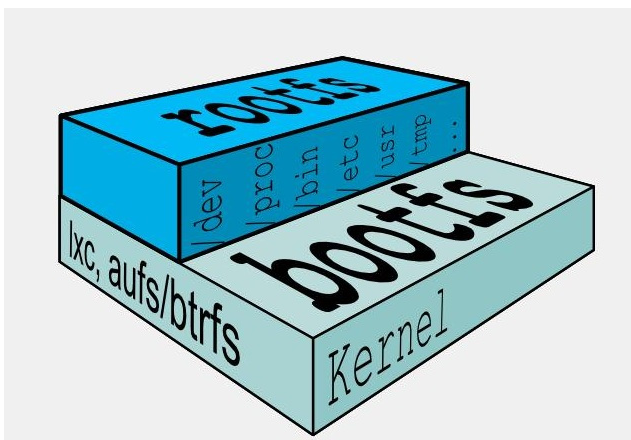

# Docker

[Docker官网](http://www.docker.com)，[DockerHub](https://hub.docker.com/)

## 一、基础篇

### 1、简介

Docker是基于Go语言实现的云开源项目。Docker的主要目标是“Build，Ship and Run Any App,Anywhere”，也就是通过对应用组件的封装、分发、部署、运行等生命周期的管理，使用户的APP（可以是一个WEB应用或数据库应用等等）及其运行环境能够做到“一次镜像，处处运行”。

Docker 就是在Linux容器技术的基础上发展过来的。将应用打成镜像，通过镜像成为运行在Docker容器上面的实例，而 Docker容器在任何操作系统上都是一致的，这就实现了跨平台、跨服务器。只需要一次配置好环境，换到别的机子上就可以一键部署好，大大简化了操作


Docker 和传统虚拟化方式的不同之处：

- 传统虚拟机技术是虚拟出一套硬件后，在其上运行一个完整操作系统，在该系统上再运行所需应用进程；
- 容器内的应用进程直接运行于宿主的内核，容器内没有自己的内核且也没有进行硬件虚拟。因此容器要比传统虚拟机更为轻便。
- 每个容器之间互相隔离，每个容器有自己的文件系统 ，容器之间进程不会相互影响，能区分计算资源。

### 2、安装

[CentOs Download](https://www.centos.org/centos-linux/)，[Install on CentOS](https://docs.docker.com/engine/install/centos/)

#### 2.1 安装步骤

1.卸载老版本

```bash
$ sudo yum remove docker \
                  docker-client \
                  docker-client-latest \
                  docker-common \
                  docker-latest \
                  docker-latest-logrotate \
                  docker-logrotate \
                  docker-engine
```

2.安装`gcc`相关

```bash
yum -y install gcc
yum -y install gcc-c++
```

3.安装`yum-utils`，设置仓库

```bash
$ sudo yum install -y yum-utils
$ sudo yum-config-manager \
    --add-repo \
    https://download.docker.com/linux/centos/docker-ce.repo  # 国外，速度慢
```

4.安装Docker引擎

```bash
$ sudo yum install docker-ce docker-ce-cli containerd.io docker-compose-plugin
```

5.启动docker

```bash
$ sudo systemctl start docker
```

6.测试

```bash
$ sudo docker version
$ sudo docker run hello-world
```

#### 2.2 卸载步骤

```bash
$ sudo systemctl stop docker
$ sudo yum remove docker-ce docker-ce-cli containerd.io
$ sudo rm -rf /var/lib/docker
$ sudo rm -rf /var/lib/containerd
```

#### 2.3 镜像加速器

针对Docker客户端版本大于 1.10.0 的用户

您可以通过修改daemon配置文件/etc/docker/daemon.json来使用加速器

```bash
sudo mkdir -p /etc/docker
sudo tee /etc/docker/daemon.json <<-'EOF'
{
  "registry-mirrors": ["https://1056mbof.mirror.aliyuncs.com"]
}
EOF
sudo systemctl daemon-reload
sudo systemctl restart docker
```

#### 2.4 run流程


### 3、常用命令

[Docker命令大全](https://www.runoob.com/docker/docker-command-manual.html)

#### 3.1 帮助启动类命令

- 启动docker： systemctl start docker
- 停止docker： systemctl stop docker
- 重启docker： systemctl restart docker
- 查看docker状态： systemctl status docker
- 开机启动： systemctl enable docker
- 查看docker概要信息： docker info
- 查看docker总体帮助文档： docker --help
- 查看docker命令帮助文档： docker 具体命令 --help

#### 3.2 镜像命令

- 列出本地主机上的镜像： docker images [OPTIONS] [REPOSITORY[:TAG]]

``` bash
REPOSITORY   TAG       IMAGE ID   CREATED   SIZE
镜像的仓库源  标签版本号    镜像ID     创建时间   大小
```

```bash
List images

Options:
  -a, --all             列出本地所有的镜像（含中间映像层，默认情况下，过滤掉中间映像层）
      --digests         显示镜像的摘要信息
  -f, --filter filter   显示满足条件的镜像
      --format string   指定返回值的模板文件
      --no-trunc        显示完整的镜像信息
  -q, --quiet           只显示镜像ID
```

- 从Docker Hub查找镜像： docker search [OPTIONS] TERM 

```bash
Search the Docker Hub for images

Options:
  -f, --filter filter   Filter output based on conditions provided
      --format string   Pretty-print search using a Go template
      --limit int       Max number of search results (default 25)
      --no-trunc        显示完整的镜像描述
```

- 下载镜像： docker pull [OPTIONS] NAME[:TAG|@DIGEST]

```bash
Pull an image or a repository from a registry

Options:
  -a, --all-tags                拉取所有 tagged 镜像
      --disable-content-trust   Skip image verification(default true)忽略镜像的校验,默认开启
      --platform string         Set platform if server is multi-platform capable
  -q, --quiet                   Suppress verbose output
```

- 删除镜像： docker rmi [OPTIONS] IMAGE [IMAGE...]

```bash
Remove one or more images

Options:
  -f, --force      Force removal of the image
      --no-prune   Do not delete untagged parents
```

​		删除全部：

```bash
docker rmi -f $(docker images -qa)
```

- 查看镜像/容器/数据卷所占空间：docker system df

#### 3.3 容器命令

- 新建+启动容器：docker run [OPTIONS] IMAGE [COMMAND] [ARG...]

```bash
OPTIONS说明（常用）：有些是一个减号，有些是两个减号 
--name="容器新名字"       为容器指定一个名称；
-d: 后台运行容器并返回容器ID，也即启动守护式容器(后台运行)；
 
-i：以交互模式运行容器，通常与 -t 同时使用；
-t：为容器重新分配一个伪输入终端，通常与 -i 同时使用；也即启动交互式容器(前台有伪终端，等待交互)；
 
-P: 随机端口映射，大写P
-p: 指定端口映射，小写p
```

进入正在运行的容器并以**命令行交互退出**方式：run进去容器，exit退出，容器停止。run进去容器，ctrl+p+q退出，容器不停止

举例：docker run -it redis /bin/bash

```bash
参数说明：
-i: 交互式操作。
-t: 终端。
redis: redis  镜像。
/bin/bash：放在镜像名后的是命令，这里我们希望有个交互式 Shell，因此用的是 /bin/bash。
要退出终端，直接输入 exit:
```

- 列出当前所有正在运行的容器： docker ps [OPTIONS]

```bash
List containers

Options:
  -a, --all             列出当前所有正在运行的容器+历史上运行过的 (default shows just running)
  -f, --filter filter   Filter output based on conditions provided
      --format string   Pretty-print containers using a Go template
  -n, --last int        显示最近n个创建的容器 (includes all states) (default -1)
  -l, --latest          显示最近创建的容器 (includes all states)
      --no-trunc        Don't truncate output
  -q, --quiet           静默模式，只显示容器编号
  -s, --size            Display total file sizes
```

- 重启已停止运行的容器

```bash
docker restart 容器ID或者容器名
```

- 停止容器

```bash
docker stop 容器ID或者容器名

docker kill 容器ID或容器名 #强制停止
```

- 删除容器

```bash
docker rm 容器ID  #删除已停止的容器
```

- 一次性删除多个容器实例

```bash
# 删除所有
docker rm -f $(docker ps -a -q)
docker ps -a -q | xargs docker rm
```

#### 3.4 重要

- 守护式容器启动

```bash
#前台交互式启动
docker run -it redis
#后台守护式启动
docker run -d redis
```

- 查看容器日志

```bash
docker logs 容器id
```

- 查看容器内运行的日志

```bash
docker top 容器id
```

- 查看容器内部细节

```bash
docker inspect 容器id
```

- 进入正在运行的容器并以命令行交互

**docker exec [OPTIONS] CONTAINER COMMAND [ARG...]**

```bash
Run a command in a running container

Options:
  -d, --detach               分离模式: 在后台运行
      --detach-keys string   Override the key sequence for detaching a container
  -e, --env list             Set environment variables
      --env-file list        Read in a file of environment variables
  -i, --interactive          即使没有附加也保持STDIN 打开
      --privileged           Give extended privileges to the command
  -t, --tty                  分配一个伪终端
  -u, --user string          Username or UID (format: <name|uid>[:<group|gid>])
  -w, --workdir string       Working directory inside the container
# 举例：docker exec -it 容器ID /bin/bash
```

**docker attach [OPTIONS] CONTAINER**

```bash
Attach local standard input, output, and error streams to a running container

Options:
      --detach-keys string   Override the key sequence for detaching a container
      --no-stdin             Do not attach STDIN
      --sig-proxy            Proxy all received signals to the process (default true)
```

区别：

· attach 直接进入容器启动命令的终端，不会启动新的进程 用exit退出，会导致容器的停止。

· exec 是在容器中打开新的终端，并且可以启动新的进程 用exit退出，不会导致容器的停止。

- 从容器内拷贝文件到主机上

```bash
docker cp  容器ID:容器内路径 目的主机路径
```

- 导入与导出容器

```bash
#docker export container_id：将一个容器导出为文件，再使用docker import 命令将容器导入成为一个新的镜像，但是相比docker save命令，容器文件会丢失所有元数据和历史记录，仅保存容器当时的状态，相当于虚拟机快照。
#export 导出容器的内容留作为一个tar归档文件[对应import命令]
docker export 容器ID > 文件名.tar
#import 从tar包中的内容创建一个新的文件系统再导入为镜像[对应export]
cat 文件名.tar | docker import - 镜像用户/镜像名:镜像版本号
```

- 导入导出镜像

```bash
#docker save images_name：将一个镜像导出为文件，再使用docker load命令将文件导入为一个镜像，会保存该镜像的的所有历史记录。比docker export命令导出的文件大，很好理解，因为会保存镜像的所有历史记录。

#docker load导入镜像库存储文件到本地镜像库
```


### 4、镜像

#### 4.1 介绍

镜像：是一种轻量级、可执行的独立软件包，它包含运行某个软件所需的所有内容，我们把应用程序和配置依赖打包好形成一个可交付的运行环境(包括代码、运行时需要的库、环境变量和配置文件等)，这个打包好的运行环境就**image镜像**文件。

只有通过这个镜像文件才能生成Docker容器实例(类似Java中new出来一个对象)


#### 4.2 联合文件系统：

UnionFS（联合文件系统）：Union文件系统（UnionFS）是一种分层、轻量级并且高性能的文件系统，它支持对文件系统的修改作为一次提交来一层层的叠加，同时可以将不同目录挂载到同一个虚拟文件系统下(unite several directories into a single virtual filesystem)。Union 文件系统是 Docker 镜像的基础。镜像可以通过分层来进行继承，基于基础镜像（没有父镜像），可以制作各种具体的应用镜像。

特性：一次同时加载多个文件系统，但从外面看起来，只能看到一个文件系统，联合加载会把各层文件系统叠加起来，这样最终的文件系统会包含所有底层的文件和目录

#### 4.3 加载原理

docker的镜像实际上由一层一层的文件系统组成，这种层级的文件系统UnionFS。

bootfs(boot file system)主要包含bootloader和kernel, bootloader主要是引导加载kernel, Linux刚启动时会加载bootfs文件系统，在Docker镜像的最底层是引导文件系统bootfs。这一层与我们典型的Linux/Unix系统是一样的，包含boot加载器和内核。当boot加载完成之后整个内核就都在内存中了，此时内存的使用权已由bootfs转交给内核，此时系统也会卸载bootfs。

 

rootfs (root file system) ，在bootfs之上。包含的就是典型 Linux 系统中的 /dev, /proc, /bin, /etc 等标准目录和文件。rootfs就是各种不同的操作系统发行版，比如Ubuntu，Centos等等



对于一个精简的OS，rootfs可以很小，只需要包括最基本的命令、工具和程序库就可以了，因为底层直接用Host的kernel，自己只需要提供 rootfs 就行了。由此可见对于不同的linux发行版, bootfs基本是一致的, rootfs会有差别, 因此不同的发行版可以公用bootfs。

#### 4.4 分层结构的好处

镜像分层最大的一个好处就是共享资源，方便复制迁移，就是为了复用。

比如说有多个镜像都从相同的 base 镜像构建而来，那么 Docker Host 只需在磁盘上保存一份 base 镜像；

同时内存中也只需加载一份 base 镜像，就可以为所有容器服务了。而且镜像的每一层都可以被共享

#### 4.5 重点

当容器启动时，一个新的可写层被加载到镜像的顶部。这一层通常被称作“容器层”，“容器层”之下的都叫“镜像层”。

所有对容器的改动 - 无论添加、删除、还是修改文件都只会发生在容器层中。只有容器层是可写的，容器层下面的所有镜像层都是只读的。


#### 4.6 commit案例

下载Ubuntu镜像到本地并运行

```bash
docker run -it ubuntu /bin/bash
```

原始的Ubuntu命令没有vim命令

```bash
root@b481c2e715a2:/# vim a.txt
bash: vim: command not found
```

安装vim

```bash
#先更新包管理工具
apt-get update
#安装vim
apt-get install vim
```

commit自己的镜像

```bash
#docker commit -m="提交的描述信息" -a="作者" 容器ID 要创建的目标镜像名:[标签名]
docker commit -m="add vim cmd" -a="huangyb" b481c2e715a2 huangyb/myubuntu:v1.0
```

查看和原来对比

```bash
[root@localhost ~]# docker images
REPOSITORY         TAG       IMAGE ID       CREATED          SIZE
huangyb/myubuntu   v1.0      3b62d03988f2   25 seconds ago   178MB
ubuntu             latest    ba6acccedd29   10 months ago    72.8MB
```


### 5、镜像发布阿里云


容器镜像服务==>个人实例==>命名空间==>创建仓库==>管理

### 6、镜像发布私有云

#### 6.1 下载Docker Registry

```bash
[root@localhost ~]# docker pull registry
```

#### 6.2 运行私有库Registry，相当于本地DockerHub

```bash
docker run -d -p 5000:5000 -v /huangyb/myregistry/:/tmp/registry --privileged=true registry
#默认情况，仓库被创建在容器的/var/lib/registry目录下，建议自行用容器卷映射，方便于宿主机联调
```

#### 6.3 创建新镜像，Ubuntu安装ifconfig命令

```bash
docker run -it ubuntu /bin/bash
apt-get update
apt-get install net-tools
docker commit -m="提交的描述信息" -a="作者" 容器ID 要创建的目标镜像名:[标签名]
```


#### 6.4 curl验证私服库有什么镜像

```bash
[root@localhost myregistry]# curl -XGET http://192.168.6.128:5000/v2/_catalog
{"repositories":[]} #空的
```


#### 6.5 将新镜像修改符合私服规范的tag

```bash
#[root@localhost myregistry]# docker tag --help
#Usage:  docker tag SOURCE_IMAGE[:TAG] TARGET_IMAGE[:TAG]
#Create a tag TARGET_IMAGE that refers to SOURCE_IMAGE

#docker tag huangyb:[标签名] 192.168.6.128:5000/huangyb:[标签名]
[root@localhost myregistry]# docker tag huangyb/myubuntu:v1.0 192.168.6.128:5000/myubuntu:v1.0
[root@localhost myregistry]# docker images
REPOSITORY                    TAG       IMAGE ID       CREATED             SIZE
192.168.6.128:5000/myubuntu   v1.0      3b62d03988f2   About an hour ago   178MB
```


#### 6.6 修改配置文件使之支持http

```bash
vim /etc/docker/daemon.json #修改配置文件
```

```json
{
  "registry-mirrors": ["https://1056mbof.mirror.aliyuncs.com"],
  "insecure-registries": ["192.168.6.128:5000"],
  "exec-opts": ["native.cgroupdriver=systemd"],
  "log-driver": "json-file",
  "log-opts": {
    "max-size": "100m"
  },
  "storage-driver": "overlay2"
```

docker默认不允许http方式推送镜像，通过配置选项来取消这个限制。====> 修改完后如果不生效，建议重启docker

#### 6.7 push推送私服

```bash
docker push 192.168.6.128:5000/myubuntu:v1.0
```


#### 6.8 curl验证私服镜像

```bash
[root@localhost myregistry]# curl -XGET http://192.168.6.128:5000/v2/_catalog
```


#### 6.9 pull本地运行

```bash
docker pull 192.168.6.128:5000/myubuntu:v1.0
```


### 7、容器数据卷


## 二、进阶篇

### 1、复杂安装

### 2、Dockerfile解析

#### 2.1 介绍

Dockerfile是用来构建Docker镜像的文本文件，是由一条条构建镜像所需的指令和参数构成的脚本。


[Dockerfile官网](https://docs.docker.com/engine/reference/builder/)

构建三步骤:

- 编写Dockerfile文件
- docker build命令构建镜像
- docker run依镜像运行容器实例

#### 2.2 构建过程

(1) 基础知识

- 每条保留字指令都必须为大写字母且后面要跟随至少一个参数
- 指令按照从上到下，顺序执
- #表示注释
- 每条指令都会创建一个新的镜像层并对镜像进行提交

(2) 执行大致流程

- docker从基础镜像运行一个容器
- 执行一条指令并对容器作出修改
- 执行类似docker commit的操作提交一个新的镜像层
- docker再基于刚提交的镜像运行一个新容器
- 执行dockerfile中的下一条指令直到所有指令都执行完成

(3) 总结

从应用软件的角度来看，Dockerfile、Docker镜像与Docker容器分别代表软件的三个不同阶段，

- Dockerfile是软件的原材料
- Docker镜像是软件的交付品
- Docker容器则可以认为是软件镜像的运行态，也即依照镜像运行的容器实例

Dockerfile面向开发，Docker镜像成为交付标准，Docker容器则涉及部署与运维，三者缺一不可，合力充当Docker体系的基石。


Dockerfile，需要定义一个Dockerfile，Dockerfile定义了进程需要的一切东西。Dockerfile涉及的内容包括执行代码或者是文件、环境变量、依赖包、运行时环境、动态链接库、操作系统的发行版、服务进程和内核进程(当应用进程需要和系统服务和内核进程打交道，这时需要考虑如何设计namespace的权限控制)等等;

Docker镜像，在用Dockerfile定义一个文件之后，docker build时会产生一个Docker镜像，当运行 Docker镜像时会真正开始提供服务;

Docker容器，容器是直接提供服务的。

#### 2.3 常用保留字指令

[Tomcat的Dockerfile文件](https://github.com/docker-library/docs/tree/master/tomcatv)

- **FROM**：基础镜像，当前新镜像是基于哪个镜像的，指定一个已经存在的镜像作为模板，第一条必须是from

- **MAINTAINER**：镜像维护者的姓名和邮箱地址

- **RUN**：容器构建时需要运行的命令

  - shell格式

     

    RUN yum -y install vim

  - exec格式

     

  - RUN是在 docker build时运行

- **EXPOSE**：当前容器对外暴露出的端口

- **WORKDIR**：指定在创建容器后，终端默认登陆的进来工作目录，一个落脚点

- **USER**：指定该镜像以什么样的用户去执行，如果都不指定，默认是root

- **ENV**：用来在构建镜像过程中设置环境变量
  
  - ENV MY_PATH /usr/mytest这个环境变量可以在后续的任何RUN指令中使用，这就如同在命令前面指定了环境变量前缀一样；也可以在其它指令中直接使用这些环境变量，比如：WORKDIR $MY_PATH
  
- **ADD**：将宿主机目录下的文件拷贝进镜像且会自动处理URL和解压tar压缩包

- **COPY**：类似ADD，拷贝文件和目录到镜像中。 将从构建上下文目录中 <源路径> 的文件/目录复制到新的一层的镜像内的 <目标路径> 位置

- **VOLUME**：容器数据卷，用于数据保存和持久化工作

- **CMD**：指定容器启动后的要干的事情

  - Dockerfile 中可以有多个 CMD 指令，但只有最后一个生效，CMD 会被 docker run 之后的参数替换
  - 举例：`docker run -it -p 8080:8080 容器ID /bin/bash` 容器Tomcat启动，但访问失败
  - CMD是在docker run 时运行，RUN是在 docker build时运行。

- **ENTRYPOINT**：也是用来指定一个容器启动时要运行的命令

  - 类似于 CMD 指令，但是ENTRYPOINT不会被docker run后面的命令覆盖， 而且这些命令行参数会被当作参数送给 ENTRYPOINT 指令指定的程序

  - ENTRYPOINT可以和CMD一起用，一般是变参才会使用 CMD ，这里的 CMD 等于是在给 ENTRYPOINT 传参。当指定了ENTRYPOINT后，CMD的含义就发生了变化，不再是直接运行其命令而是将CMD的内容作为参数传递给ENTRYPOINT指令，他两个组合会变成<ENTRYPOINT >'<CMD>'

  - ```dockerfile
    From nginx
    ENTRYPOINT ["nginx", "-c"] #定参
    CMD ["/etc/nginx/nginx.conf"] #变参
    ```

  - | 是否传参         | 按照dockerfile编写执行         | 传参运行                                     |
    | ---------------- | ------------------------------ | -------------------------------------------- |
    | Docker命令       | docker run nginx:test          | docker run nginx:test -c /etc/nginx/new.conf |
    | 衍生出的实际命令 | nginx -c /etc/nginx/nginx.conf | nginx -c /etc/nginx/new.conf                 |

#### 2.4 案例

[JDK官方下载](https://www.oracle.com/java/technologies/downloads/#java8)  [Oracle账号分享](http://bugmenot.com/view/oracle.com)  [JDK下载mirrors](https://mirrors.yangxingzhen.com/jdk/)

创建CentOS镜像，Centos7镜像具备vim+ifconfig+jdk8

(1) 创建文件夹，下载jdk，创建Dockerfile文件

```bash
[root@localhost myfile]# ll
总用量 144692
-rw-r--r--. 1 root root         0 8月  16 15:37 Dockerfile
-rw-r--r--. 1 root root 148162542 8月  16 15:33 jdk-8u341-linux-x64.tar.gz
```

Dockerfile文件

```dockerfile
#继承镜像为centos
FROM centos:7
#指定作者和邮箱
MAINTAINER huangyb<huangyb@123456.com>

#KV键值对，定义MYPATH为/usr/local
ENV MYPATH /usr/local
#登录后进入该目录
WORKDIR $MYPATH
 
#安装vim编辑器
RUN yum -y install vim
#安装ifconfig命令查看网络IP
RUN yum -y install net-tools
#安装java8及lib库
RUN yum -y install glibc.i686
RUN mkdir /usr/local/java
#ADD 是相对路径jar,把jdk-8u341-linux-x64.tar.gz添加到容器中,安装包必须要和Dockerfile文件在同一位置
ADD jdk-8u341-linux-x64.tar.gz /usr/local/java/
#配置java环境变量
ENV JAVA_HOME /usr/local/java/jdk1.8.0_341
ENV JRE_HOME $JAVA_HOME/jre
ENV CLASSPATH $JAVA_HOME/lib/dt.jar:$JAVA_HOME/lib/tools.jar:$JRE_HOME/lib:$CLASSPATH
ENV PATH $JAVA_HOME/bin:$PATH
 
EXPOSE 80
 
CMD echo $MYPATH
CMD echo "success--------------ok"
CMD /bin/bash
```

大写字母D

(2) 构建

```bash
#-t: 镜像的名字及标签
docker build -t centosjava8:v1.0 .
```


```bash
[root@localhost myfile]# docker images
REPOSITORY                    TAG       IMAGE ID       CREATED          SIZE
centosjava8                   v1.0      0e5cde683d54   19 seconds ago   1.22GB
```

(3) 运行

```bash
[root@localhost myfile]# docker run -it 0e5cde683d54 /bin/bash
[root@ab75ec1b5c97 local]# java -version
java version "1.8.0_341"
Java(TM) SE Runtime Environment (build 1.8.0_341-b10)
Java HotSpot(TM) 64-Bit Server VM (build 25.341-b10, mixed mode)
```

#### 2.5 虚悬镜像

仓库名、标签都是<none>的镜像，俗称dangling image

删除：`docker image prune`

### 3、Docker微服务实战


### 4、网络

```cmd
[root@master ~]# ifconfig
docker0: flags=4099<UP,BROADCAST,MULTICAST>  mtu 1500
        inet 172.17.0.1  netmask 255.255.0.0  broadcast 172.17.255.255
        ether 02:42:41:a8:1a:78  txqueuelen 0  (Ethernet)
        RX packets 0  bytes 0 (0.0 B)
        RX errors 0  dropped 0  overruns 0  frame 0
        TX packets 0  bytes 0 (0.0 B)
        TX errors 0  dropped 0 overruns 0  carrier 0  collisions 0

ens33: flags=4163<UP,BROADCAST,RUNNING,MULTICAST>  mtu 1500
        inet 192.168.6.128  netmask 255.255.255.0  broadcast 192.168.6.255
        ether 00:0c:29:6d:60:68  txqueuelen 1000  (Ethernet)
        RX packets 8426  bytes 1038295 (1013.9 KiB)
        RX errors 0  dropped 0  overruns 0  frame 0
        TX packets 8719  bytes 4526589 (4.3 MiB)
        TX errors 0  dropped 0 overruns 0  carrier 0  collisions 0

flannel.1: flags=4163<UP,BROADCAST,RUNNING,MULTICAST>  mtu 1450
        inet 10.244.0.0  netmask 255.255.255.255  broadcast 0.0.0.0
        ether 5e:7a:15:ae:6c:60  txqueuelen 0  (Ethernet)
        RX packets 0  bytes 0 (0.0 B)
        RX errors 0  dropped 0  overruns 0  frame 0
        TX packets 0  bytes 0 (0.0 B)
        TX errors 0  dropped 17 overruns 0  carrier 0  collisions 0

lo: flags=73<UP,LOOPBACK,RUNNING>  mtu 65536
        inet 127.0.0.1  netmask 255.0.0.0
        loop  txqueuelen 1000  (Local Loopback)
        RX packets 154845  bytes 30894310 (29.4 MiB)
        RX errors 0  dropped 0  overruns 0  frame 0
        TX packets 154845  bytes 30894310 (29.4 MiB)
        TX errors 0  dropped 0 overruns 0  carrier 0  collisions 0

virbr0: flags=4099<UP,BROADCAST,MULTICAST>  mtu 1500
        inet 192.168.122.1  netmask 255.255.255.0  broadcast 192.168.122.255
        ether 52:54:00:48:84:92  txqueuelen 1000  (Ethernet)
        RX packets 0  bytes 0 (0.0 B)
        RX errors 0  dropped 0  overruns 0  frame 0
        TX packets 0  bytes 0 (0.0 B)
        TX errors 0  dropped 0 overruns 0  carrier 0  collisions 0
```

查看docker网络模式：

```cmd
#默认创建两种网络模式
[root@master ~]# docker network ls
NETWORK ID     NAME      DRIVER    SCOPE
f711d6ddb4fb   bridge    bridge    local
7a20ef4aeaea   host      host      local
862f657dcf4c   none      null      local
```


#### 4.1 介绍


#### 4.2 常见基本命令

(1) 全部命令

```bash
[root@master ~]# docker network --help

Usage:  docker network COMMAND

Manage networks

Commands:
  connect     Connect a container to a network
  create      Create a network
  disconnect  Disconnect a container from a network
  inspect     Display detailed information on one or more networks
  ls          List networks
  prune       Remove all unused networks
  rm          Remove one or more networks
```

(2) 查看网络

```bash
[root@master ~]# docker network ls
NETWORK ID     NAME      DRIVER    SCOPE
f711d6ddb4fb   bridge    bridge    local
7a20ef4aeaea   host      host      local
862f657dcf4c   none      null      local
```


#### 4.3 作用

#### 4.4 网络模式

#### 4.5 架构图


### 5、Docker-compose容器编排


### 6、可视化工具Portainer

### 7、容器监控之 CAdvisor+InfluxDB+Granfana
